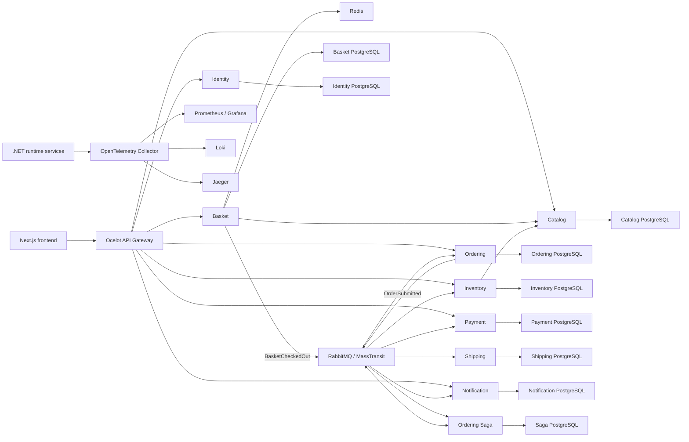

# ECommerce Microservices

[English](#english) | [Türkçe](#türkçe)

## English

### Overview

ECommerce Microservices is a full-stack reference project for an event-driven
e-commerce platform. The backend is built with independently deployable .NET
microservices, database-per-service persistence, asynchronous messaging, and a
durable saga-based order workflow. A Next.js application provides customer,
seller, and administrator experiences.

The project focuses on practical service boundaries, secure authorization,
reliable message delivery, observable runtime behavior, and maintainable
application structure. It is intended as a technical portfolio and learning
project rather than a production-ready commerce product.

### Main capabilities

- Public catalog search, filtering, sorting, pagination, and product details
- Customer baskets backed by local Redis
- Server-authoritative product pricing during basket operations
- Durable checkout snapshots and transactional outbox delivery
- Distributed inventory, payment, shipping, and notification workflow
- Saga orchestration with idempotency and compensating actions
- Customer order history, delivery details, status timeline, and payment summary
- Ownership-protected, idempotent pre-payment order cancellation with saga compensation
- Seller-owned store creation/editing, product and stock management, and Cloudinary-backed product images
- A Seller order workspace with store/status filters, date sorting, bounded
  server pagination, lightweight summaries, on-demand store items, and totals
  without customer identity, address, or other-store data
- Read-only administrator user directory, catalog-wide product management, and
  independent Admin-only category/brand list pages with database-side search,
  status filters, stable sorting, bounded pagination, and separate create/edit
  forms
- Auth0 login with Customer, Seller, and Admin authorization boundaries
- Resource ownership checks for customer and seller data
- English and Turkish frontend content and localized API errors
- Persisted notifications with single/bulk read actions and SignalR-based live updates
- Traces, metrics, logs, dashboards, alerts, and health checks

### Architecture



Client-facing HTTP and SignalR traffic enters through the API Gateway.
Services do not share business tables. Synchronous integration uses focused
HTTP clients; asynchronous workflows use contracts published through
MassTransit and RabbitMQ.

MVC controllers and message consumers dispatch commands and queries through
MediatR. Handlers call focused Application services; transport code does not
reach persistence directly.
Domain, Application, Infrastructure, and API/Worker projects follow inward
dependency rules. EF-backed aggregates use a minimal generic repository and
unit of work, while searches, projections, metrics, and business-key lookups
remain focused read interfaces.

### Services

| Service | Responsibility |
| --- | --- |
| API Gateway | Ocelot routing, authentication boundary, localized authorization responses, and rate limiting |
| Catalog | Products, translations, categories, brands, stores, lifecycle state, and product images |
| Basket | Redis-backed active baskets, canonical catalog pricing, checkout snapshots, and checkout handoff |
| Ordering | Orders, order items, delivery address, status history, paged customer/Seller views, and Admin operations reads |
| Inventory | Seller-managed stock, reservations, releases, and Admin operations reads |
| Payment | Provider-neutral authorization/refund workflow, customer-safe summaries, and Admin operations reads |
| Shipping | Event-driven shipment creation, customer-safe tracking, and Admin operations reads |
| Notification | Persisted notifications, unread state, and SignalR delivery |
| Identity | Local user profiles, roles, Auth0 subject mapping, and role reconciliation |
| Ordering Saga | Durable order orchestration and compensation |

The included `DemoPaymentProvider` never performs a real charge. It requires no
card form, card number, CVV, or payment-provider account. Success and failure
scenarios are selected only through server configuration.

### Order workflow

1. Basket resolves product name, price, currency, availability, and server-owned store attribution from Catalog.
2. Checkout persists an immutable snapshot and publishes `BasketCheckedOut`
   through the EF Core transactional outbox.
3. Ordering creates the order idempotently and publishes `OrderSubmitted`.
4. The Ordering Saga coordinates inventory reservation, demo payment
   authorization, shipment creation, and final confirmation.
5. Failures trigger the appropriate compensation, such as inventory release or
   payment refund.
6. Customers may request cancellation before payment authorization; the saga
   releases reserved stock and compensates a late in-flight payment result.
7. Ordering records customer-safe status history while Notification persists
   and broadcasts updates.

### Technology stack

| Area | Technologies |
| --- | --- |
| Backend | C# 14, .NET 10, ASP.NET Core MVC APIs |
| Frontend | Next.js 16, React 19, TypeScript 5.7 |
| UI | Tailwind CSS 4, shadcn, Base UI, Lucide |
| API Gateway | Ocelot 24 |
| Persistence | Entity Framework Core 10, Npgsql, PostgreSQL |
| Cache | Redis 7, StackExchange.Redis |
| Messaging | RabbitMQ, MassTransit 8.5, EF Core transactional outbox |
| Workflow | MassTransit state-machine saga, idempotent consumers, compensating actions |
| Authentication | Auth0, OAuth 2.0, OpenID Connect, JWT Bearer, Authorization Code with PKCE |
| Authorization | Policy-based roles and permissions, customer/seller resource ownership |
| Real-time | ASP.NET Core SignalR, Microsoft SignalR JavaScript client |
| Media | Cloudinary through a server-side provider boundary |
| Observability | OpenTelemetry, OTLP, Prometheus, Grafana, Loki, Jaeger |
| Secrets | Infisical or local environment configuration |
| Infrastructure | Docker, Docker Compose, multi-stage Docker builds |
| Testing | xUnit, contract tests, hosted integration tests, architecture guards, coverlet |
| Quality | ESLint, TypeScript, PowerShell validation, npm audit gate |
| CI/CD | GitHub Actions, Docker BuildKit, GitHub OIDC for managed runtime checks |

### Security and reliability

- Auth0 access tokens are validated for issuer and audience.
- Browser authentication uses the Next.js Auth0 BFF and Authorization Code with
  PKCE.
- Session state, including ID and rotating refresh tokens, stays in an
  encrypted HttpOnly, SameSite cookie; browser code receives only a short-lived
  API access token from the same-origin token broker.
- Login, callback, and logout return paths are restricted to same-origin paths.
- API mutations use explicit authorization policies.
- Customer and seller resources are protected with ownership checks.
- Runtime machine permissions are intentionally narrow and tested for exact
  scope.
- User-facing application errors use stable codes with English and Turkish
  localized messages.
- The frontend applies CSP, framing, MIME-sniffing, referrer, permissions, and
  production transport security headers.
- PostgreSQL writes normalize application timestamps to UTC
  `DateTimeOffset` values.
- Transactional outboxes and idempotent consumers protect at-least-once message
  delivery.
- Telemetry applies sensitive-key redaction before export.
- RabbitMQ `_error` and `_skipped` queues are monitored during managed runtime
  checks.

### Repository structure

```text
src/
  ApiGateways/       Ocelot API Gateway
  BuildingBlocks/    Shared contracts and cross-cutting infrastructure
  Frontend/          Next.js web application
  Services/          Domain microservices and Ordering Saga worker
tests/               Unit, contract, hosted integration, and architecture tests
tools/               Runtime workflow verification client
deploy/              Observability configuration and dashboards
scripts/             Validation, migration, startup, and runtime-check tooling
```

### Getting started

#### Prerequisites

- .NET SDK 10.0.301 or a compatible .NET 10 feature band
- Node.js 24 and npm
- Docker Desktop with Docker Compose
- PostgreSQL connection strings for the nine service databases
- RabbitMQ connection details
- Auth0 configuration for authenticated flows
- Cloudinary configuration for product-image operations
- Infisical CLI access for injecting backend and frontend secrets

#### Configuration

Create the non-secret local Compose configuration from the example:

```powershell
Copy-Item .env.example .env
```

Keep database, RabbitMQ, Auth0, Cloudinary, and other secrets in Infisical.
The examples document variable names only; do not copy secret values into
tracked or local environment files. The Compose Gateway allows
`http://localhost:3000` by default; set the non-secret `CORS_ALLOWED_ORIGIN`
value when the frontend uses a different origin.

The frontend uses a server-side Auth0 BFF. In **Applications > Applications >
your frontend application > Settings**, set **Application Type** to
**Regular Web Application**, then configure:

- Allowed Callback URLs: `http://localhost:3000/auth/callback`
- Allowed Logout URLs:
  `http://localhost:3000,http://localhost:3000/login`

For the documented managed local/runtime checks, use the Infisical `staging`
environment at secret path `/` and create/update these frontend process
variables:

```text
AUTH0_DOMAIN
AUTH0_CLIENT_ID
AUTH0_CLIENT_SECRET
AUTH0_SECRET
AUTH0_AUDIENCE
APP_BASE_URL
```

Set `AUTH0_AUDIENCE` to the existing API identifier and
`APP_BASE_URL=http://localhost:3000`. Generate a separate 32-byte hexadecimal
`AUTH0_SECRET` for cookie encryption and store only its output in Infisical:

```powershell
$bytes = New-Object byte[] 32
$rng = [System.Security.Cryptography.RandomNumberGenerator]::Create()
try { $rng.GetBytes($bytes) } finally { $rng.Dispose() }
([BitConverter]::ToString($bytes) -replace "-", "").ToLowerInvariant()
```

`AUTH0_CLIENT_SECRET` and `AUTH0_SECRET` are server-only secrets: never prefix
them with `NEXT_PUBLIC_`, place them in `.env.local`, or expose them in command
output. Allowed Web Origins is not needed for this BFF flow. Save the Auth0
settings after editing them. Use the corresponding HTTPS URLs in deployed
environments and do not add wildcard or localhost production entries.

#### Start the backend

The startup script validates required configuration, runs the .NET tests,
builds the Compose application, waits briefly, and executes the smoke tests:

```powershell
./scripts/start-local.ps1
```

To start Compose directly:

```powershell
docker compose up --build -d
```

When configuration is stored in Infisical, build and start the complete
backend graph with secret injection:

```powershell
./scripts/run-with-secrets.ps1 -Environment dev docker compose up --build --detach
```

Apply database migrations to each isolated Infisical environment explicitly.
The environment argument is mandatory so a migration cannot silently default
to the wrong database set:

```powershell
./scripts/apply-migrations.ps1 -Environment dev -Service all
./scripts/apply-migrations.ps1 -Environment staging -Service all
```

`dev` and `staging` use their own `ConnectionStrings__*Db` values. Updating one
does not update the other; run both commands when both environments must share
the same schema version.

Wait for the Gateway and every downstream service to become ready:

```powershell
./scripts/wait-for-runtime.ps1 -TimeoutSeconds 240
```

Inspect or stop the graph:

```powershell
docker compose ps
docker compose down --volumes --remove-orphans
```

On Windows, Docker may report `Ports are not available` when a default host
port belongs to an OS-excluded range even though no process is listening.
Host-side ports can be changed without affecting container-to-container
addresses or Gateway routes. Add these non-secret overrides to the root
`.env` file if the default Catalog, Ordering, Shipping, or Notification ports
are unavailable:

```dotenv
CATALOG_API_HOST_PORT=15283
ORDERING_API_HOST_PORT=15265
SHIPPING_API_HOST_PORT=15187
NOTIFICATION_API_HOST_PORT=15234
OTEL_COLLECTOR_HEALTH_HOST_PORT=14133
```

The `.env` file is ignored by Git. Docker Desktop can subsequently start an
already-created Compose application with these port overrides. If containers
must be created again and secrets are not stored in `.env`, run the Infisical
command above once so the new containers receive their required configuration.

#### Start the frontend

```powershell
npm --prefix ./src/Frontend ci
./scripts/run-frontend.ps1 -Environment staging
```

#### Local URLs

| Component | URL |
| --- | --- |
| Frontend | `http://localhost:3000` |
| API Gateway | `http://localhost:5080` |
| Gateway live health | `http://localhost:5080/health/live` |
| Gateway readiness | `http://localhost:5080/health/ready` |
| Grafana | `http://localhost:3001` |
| Prometheus | `http://localhost:9090` |
| Jaeger | `http://localhost:16686` |

### Validation

Backend:

```powershell
dotnet restore ECommerce.sln
dotnet build ECommerce.sln --no-restore
dotnet test ECommerce.sln --no-build
```

Frontend:

```powershell
Set-Location src/Frontend
npm ci
npm run lint
npm run test:security-headers
npm run build
```

Repository and observability:

```powershell
./scripts/validate-local.ps1 -SkipBuild
./scripts/validate-observability.ps1
./scripts/probe-observability-pipeline.ps1
```

The isolated observability probe requires a clean project Compose state. It
sends synthetic non-sensitive metrics only to the local Collector, verifies
Prometheus alert evaluation and Grafana provisioning, and removes its
containers and disposable volumes when complete.

---

## Türkçe

### Genel bakış

ECommerce Microservices, event-driven bir e-ticaret platformunu uçtan uca
gösteren referans projedir. Backend; bağımsız çalıştırılabilen .NET
mikroservisleri, servis başına veritabanı yaklaşımı, asenkron mesajlaşma ve
kalıcı saga tabanlı sipariş akışı üzerine kuruludur. Next.js uygulaması müşteri,
satıcı ve yönetici deneyimlerini sağlar.

Proje; gerçekçi servis sınırlarına, güvenli yetkilendirmeye, güvenilir mesaj
teslimine, gözlemlenebilir çalışma ortamına ve sürdürülebilir kod yapısına
odaklanır. Production'a hazır bir ticaret ürünü değil, teknik portföy ve öğrenme
amaçlı bir çalışmadır.

### Temel özellikler

- Herkese açık katalog arama, filtreleme, sıralama ve sayfalama
- Yerel Redis üzerinde tutulan müşteri sepetleri
- Sepet işlemlerinde sunucu tarafından doğrulanan katalog fiyatları
- Kalıcı checkout snapshot'ı ve transactional outbox ile güvenilir aktarım
- Dağıtık stok, ödeme, kargo ve bildirim iş akışı
- Idempotency ve compensation adımları içeren saga orkestrasyonu
- Sipariş geçmişi, teslimat bilgileri, durum zaman çizelgesi ve ödeme özeti
- Sahiplik korumalı, idempotent ve saga telafili ödeme öncesi sipariş iptali
- Satıcıya ait mağaza oluşturma/düzenleme, ürün ve stok yönetimi ile Cloudinary ürün görselleri
- Mağaza/durum filtreleri, tarih sıralaması ve sınırlı sunucu sayfalamasıyla,
  hafif özetler ve isteğe bağlı kalem detayları sunarak müşteri kimliği, adresi
  veya diğer mağazaların verileri açığa çıkmadan yalnızca
  seçili mağazanın kalemlerini ve toplamlarını sunan Satıcı sipariş çalışma alanı
- Salt okunur yönetici kullanıcı dizini, katalog genelinde ürün yönetimi ve
  veritabanı tarafında arama, durum filtresi, kararlı sıralama, sınırlı
  sayfalama ve ayrı ekleme/düzenleme formları sunan bağımsız Admin
  kategori/marka liste sayfaları
- Customer, Seller ve Admin sınırlarıyla Auth0 kimlik doğrulaması
- Müşteri ve satıcı kaynaklarında sahiplik kontrolleri
- Türkçe/İngilizce arayüz ve localized API hata mesajları
- Tekil/toplu okundu işlemleri, kalıcı bildirim geçmişi ve SignalR canlı güncellemeleri
- Trace, metric, log, dashboard, alert ve health check altyapısı

### Mimari

Tarayıcıdan gelen HTTP ve SignalR trafiği API Gateway üzerinden sisteme girer.
Servisler iş tablolarını paylaşmaz. Senkron entegrasyonlar odaklı HTTP
istemcileriyle, asenkron iş akışları ise MassTransit ve RabbitMQ üzerinden
yayımlanan ortak sözleşmelerle yürütülür.

MVC controller'ları ve mesaj consumer'ları command/query isteklerini MediatR
üzerinden gönderir. Handler'lar odaklı Application servislerini çağırır; transport
kodu persistence katmanına doğrudan erişmez. Domain, Application, Infrastructure ve API/Worker projeleri içe doğru
bağımlılık kuralını izler. EF tabanlı aggregate'ler minimal generic repository
ve unit of work kullanırken arama, projection, metric ve business-key okumaları
odaklı read interface'lerinde kalır.

### Servisler

| Servis | Sorumluluk |
| --- | --- |
| API Gateway | Ocelot routing, kimlik doğrulama sınırı, localized yetki hataları ve rate limiting |
| Catalog | Ürünler, çeviriler, kategoriler, markalar, mağazalar, yaşam döngüsü ve görseller |
| Basket | Redis sepetleri, katalogdan doğrulanan fiyatlar, checkout snapshot'ı ve handoff |
| Ordering | Siparişler, kalemler, teslimat adresi, durum geçmişi, sayfalı müşteri/Seller görünümleri ve Admin operasyon okumaları |
| Inventory | Satıcı tarafından yönetilen stok, rezervasyon, stok serbest bırakma ve Admin operasyon okumaları |
| Payment | Provider-neutral authorization/refund akışı, güvenli müşteri özeti ve Admin operasyon okumaları |
| Shipping | Event-driven gönderi oluşturma, güvenli müşteri takibi ve Admin operasyon okumaları |
| Notification | Kalıcı bildirimler, okunmamış durumu ve SignalR teslimi |
| Identity | Yerel kullanıcı profili, roller, Auth0 subject eşlemesi ve rol uzlaştırma |
| Ordering Saga | Kalıcı sipariş orkestrasyonu ve compensation |

Projede bulunan `DemoPaymentProvider` gerçek ödeme veya tahsilat yapmaz. Kart
formu, kart numarası, CVV ya da ödeme sağlayıcısı hesabı gerektirmez. Başarı ve
hata senaryoları yalnızca sunucu konfigürasyonundan seçilir.

### Sipariş akışı

1. Basket; ürün adı, fiyat, para birimi, kullanılabilirlik ve sunucunun sahip
   olduğu mağaza eşlemesi bilgisini
   Catalog'dan doğrular.
2. Checkout değiştirilemez bir snapshot kaydeder ve `BasketCheckedOut` eventini
   EF Core transactional outbox üzerinden yayımlar.
3. Ordering siparişi idempotent olarak oluşturur ve `OrderSubmitted` eventini
   yayımlar.
4. Ordering Saga; stok rezervasyonu, demo ödeme yetkilendirmesi, gönderi
   oluşturma ve sipariş onayını koordine eder.
5. Hatalarda stok serbest bırakma veya ödeme iadesi gibi uygun compensation
   adımları çalışır.
6. Müşteri ödeme onayından önce iptal isteyebilir; saga ayrılan stoğu bırakır
   ve yoldaki geç ödeme sonucunu telafi eder.
7. Ordering müşteriye güvenli durum geçmişini kaydeder; Notification
   güncellemeleri saklar ve canlı olarak iletir.

### Kullanılan teknolojiler

| Alan | Teknolojiler |
| --- | --- |
| Backend | C# 14, .NET 10, ASP.NET Core MVC API'leri |
| Frontend | Next.js 16, React 19, TypeScript 5.7 |
| UI | Tailwind CSS 4, shadcn, Base UI, Lucide |
| API Gateway | Ocelot 24 |
| Veri erişimi | Entity Framework Core 10, Npgsql, PostgreSQL |
| Cache | Redis 7, StackExchange.Redis |
| Mesajlaşma | RabbitMQ, MassTransit 8.5, EF Core transactional outbox |
| İş akışı | MassTransit state-machine saga, idempotent consumer'lar, compensation |
| Kimlik doğrulama | Auth0, OAuth 2.0, OpenID Connect, JWT Bearer, PKCE |
| Yetkilendirme | Policy tabanlı rol/izin kontrolü ve kaynak sahipliği |
| Gerçek zamanlı iletişim | ASP.NET Core SignalR ve Microsoft SignalR JavaScript istemcisi |
| Medya | Sunucu tarafı provider sınırı üzerinden Cloudinary |
| Gözlemlenebilirlik | OpenTelemetry, OTLP, Prometheus, Grafana, Loki, Jaeger |
| Secret yönetimi | Infisical veya yerel environment konfigürasyonu |
| Altyapı | Docker, Docker Compose, multi-stage Docker build |
| Test | xUnit, contract testleri, hosted integration testleri, mimari kontroller, coverlet |
| Kod kalitesi | ESLint, TypeScript, PowerShell doğrulamaları, npm audit kontrolü |
| CI/CD | GitHub Actions, Docker BuildKit, managed runtime için GitHub OIDC |

### Güvenlik ve güvenilirlik

- Auth0 access token'ları issuer ve audience bilgileriyle doğrulanır.
- Tarayıcı kimlik doğrulaması Next.js Auth0 BFF ve Authorization Code with PKCE
  kullanır.
- ID ve rotating refresh token dahil oturum durumu şifreli HttpOnly, SameSite
  cookie'de kalır; tarayıcı kodu yalnızca same-origin token broker üzerinden
  kısa ömürlü API access token alır.
- Login, callback ve logout dönüş adresleri same-origin path'lerle sınırlandırılır.
- API mutation endpointleri açık authorization policy'leri kullanır.
- Müşteri ve satıcı kaynakları sahiplik kontrolleriyle korunur.
- Runtime makine izinleri dar tutulur ve exact scope ile doğrulanır.
- Kullanıcıya gösterilen uygulama hataları stabil kodlara ve Türkçe/İngilizce
  localized mesajlara sahiptir.
- Frontend; CSP, framing, MIME-sniffing, referrer, permissions ve production
  transport security header'larını uygular.
- PostgreSQL yazımlarındaki uygulama zamanları UTC `DateTimeOffset` olarak
  normalize edilir.
- Transactional outbox ve idempotent consumer'lar at-least-once mesaj teslimini
  güvenli hale getirir.
- Telemetry dışa aktarılmadan önce hassas anahtar redaction'ından geçer.
- Managed runtime kontrollerinde RabbitMQ `_error` ve `_skipped` kuyrukları
  izlenir.

### Proje yapısı

```text
src/
  ApiGateways/       Ocelot API Gateway
  BuildingBlocks/    Ortak sözleşmeler ve cross-cutting altyapı
  Frontend/          Next.js web uygulaması
  Services/          Domain mikroservisleri ve Ordering Saga worker
tests/               Unit, contract, hosted integration ve mimari testler
tools/               Runtime iş akışı doğrulama istemcisi
deploy/              Observability konfigürasyonu ve dashboard'lar
scripts/             Validation, migration, startup ve runtime araçları
```

### Çalıştırma

#### Gereksinimler

- .NET SDK 10.0.301 veya uyumlu bir .NET 10 feature band
- Node.js 24 ve npm
- Docker Desktop ve Docker Compose
- Dokuz servis veritabanı için PostgreSQL connection string'leri
- RabbitMQ bağlantı bilgileri
- Kimlik doğrulamalı akışlar için Auth0 konfigürasyonu
- Ürün görsel işlemleri için Cloudinary konfigürasyonu
- Backend ve frontend secret'larını enjekte etmek için Infisical CLI erişimi

#### Konfigürasyon

Secret içermeyen yerel Compose konfigürasyonunu örnekten oluşturun:

```powershell
Copy-Item .env.example .env
```

Veritabanı, RabbitMQ, Auth0, Cloudinary ve diğer secret'ları Infisical'da
tutun. Örnek dosyalar yalnızca değişken adlarını belgeler; secret değerlerini
tracked veya yerel environment dosyalarına kopyalamayın. Compose Gateway
varsayılan olarak `http://localhost:3000` origin'ine izin verir; frontend
farklı bir origin kullanıyorsa secret olmayan `CORS_ALLOWED_ORIGIN` değerini
ayarlayın.

Frontend sunucu taraflı Auth0 BFF kullanır. **Applications > Applications >
frontend uygulamanız > Settings** bölümünde **Application Type** değerini
**Regular Web Application** yapın ve şunları ayarlayın:

- Allowed Callback URLs: `http://localhost:3000/auth/callback`
- Allowed Logout URLs:
  `http://localhost:3000,http://localhost:3000/login`

Belgelenen managed yerel/runtime kontrolleri için Infisical `staging`
ortamının `/` secret path'inde şu frontend process değişkenlerini
oluşturun/güncelleyin:

```text
AUTH0_DOMAIN
AUTH0_CLIENT_ID
AUTH0_CLIENT_SECRET
AUTH0_SECRET
AUTH0_AUDIENCE
APP_BASE_URL
```

`AUTH0_AUDIENCE` için mevcut API identifier değerini, `APP_BASE_URL` için
`http://localhost:3000` kullanın. Cookie şifrelemesi için ayrı bir 32-byte
hexadecimal `AUTH0_SECRET` üretin ve yalnızca çıktısını Infisical'a kaydedin:

```powershell
$bytes = New-Object byte[] 32
$rng = [System.Security.Cryptography.RandomNumberGenerator]::Create()
try { $rng.GetBytes($bytes) } finally { $rng.Dispose() }
([BitConverter]::ToString($bytes) -replace "-", "").ToLowerInvariant()
```

`AUTH0_CLIENT_SECRET` ve `AUTH0_SECRET` yalnızca sunucuda tutulan secret'lardır;
başlarına `NEXT_PUBLIC_` eklemeyin, `.env.local` dosyasına koymayın ve komut
çıktısında göstermeyin. Bu BFF akışında Allowed Web Origins gerekmez. Ayarları
kaydedin; deployment ortamında karşılık gelen HTTPS adreslerini kullanın ve
production için wildcard ya da localhost eklemeyin.

#### Backend'i başlatma

Başlangıç scripti gerekli konfigürasyonu doğrular, .NET testlerini çalıştırır,
Compose uygulamasını build eder ve smoke testleri yürütür:

```powershell
./scripts/start-local.ps1
```

Compose'u doğrudan başlatmak için:

```powershell
docker compose up --build -d
```

Konfigürasyon Infisical'da tutuluyorsa tüm backend servislerini secret
enjeksiyonu ile build edip başlatın:

```powershell
./scripts/run-with-secrets.ps1 -Environment dev docker compose up --build --detach
```

Veritabanı migration'larını her izole Infisical ortamına açıkça uygulayın.
Yanlış veritabanı grubunun sessizce seçilmemesi için ortam parametresi
zorunludur:

```powershell
./scripts/apply-migrations.ps1 -Environment dev -Service all
./scripts/apply-migrations.ps1 -Environment staging -Service all
```

`dev` ve `staging` kendi `ConnectionStrings__*Db` değerlerini kullanır. Birini
güncellemek diğerini güncellemez; iki ortamın şeması eşitlenecekse iki komutu da
çalıştırın.

Gateway ve tüm servisler hazır olana kadar bekleyin:

```powershell
./scripts/wait-for-runtime.ps1 -TimeoutSeconds 240
```

Compose durumunu görüntülemek veya uygulamayı kapatmak için:

```powershell
docker compose ps
docker compose down --volumes --remove-orphans
```

Windows'ta herhangi bir process portu dinlemese bile port, işletim sisteminin
excluded range listesinde bulunuyorsa Docker `Ports are not available` hatası
verebilir. Container'lar arası adresleri ve Gateway rotalarını değiştirmeden
yalnızca host portlarını değiştirebilirsiniz. Varsayılan Catalog, Ordering,
Shipping veya Notification portları kullanılamıyorsa kök `.env` dosyasına şu
secret içermeyen override'ları ekleyin:

```dotenv
CATALOG_API_HOST_PORT=15283
ORDERING_API_HOST_PORT=15265
SHIPPING_API_HOST_PORT=15187
NOTIFICATION_API_HOST_PORT=15234
OTEL_COLLECTOR_HEALTH_HOST_PORT=14133
```

`.env` Git tarafından ignore edilir. Docker Desktop daha önce bu port
override'larıyla oluşturulmuş Compose uygulamasını daha sonra Start düğmesiyle
başlatabilir. Container'lar yeniden oluşturulacaksa ve secret'lar `.env`
dosyasında bulunmuyorsa gerekli konfigürasyonun yeni container'lara aktarılması
için yukarıdaki Infisical komutunu bir kez çalıştırın.

#### Frontend'i başlatma

```powershell
npm --prefix ./src/Frontend ci
./scripts/run-frontend.ps1 -Environment staging
```

#### Yerel adresler

| Bileşen | Adres |
| --- | --- |
| Frontend | `http://localhost:3000` |
| API Gateway | `http://localhost:5080` |
| Gateway live health | `http://localhost:5080/health/live` |
| Gateway readiness | `http://localhost:5080/health/ready` |
| Grafana | `http://localhost:3001` |
| Prometheus | `http://localhost:9090` |
| Jaeger | `http://localhost:16686` |

### Doğrulama

Backend:

```powershell
dotnet restore ECommerce.sln
dotnet build ECommerce.sln --no-restore
dotnet test ECommerce.sln --no-build
```

Frontend:

```powershell
Set-Location src/Frontend
npm ci
npm run lint
npm run test:security-headers
npm run build
```

Repository ve observability:

```powershell
./scripts/validate-local.ps1 -SkipBuild
./scripts/validate-observability.ps1
./scripts/probe-observability-pipeline.ps1
```

İzole observability probe'u temiz bir proje Compose durumu gerektirir. Yalnızca
yerel Collector'a sentetik ve hassas olmayan metric'ler gönderir, Prometheus
alert değerlendirmesini ve Grafana provisioning'i doğrular, ardından kendi
container ve geçici volume'lerini kaldırır.
