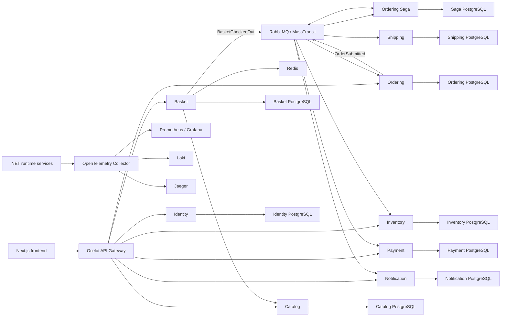

# ECommerce Microservices

[English](#english) | [Türkçe](#türkçe)

## English

### Overview

ECommerce Microservices is a full-stack reference project for an event-driven
e-commerce platform. The backend is built with independently deployable .NET
microservices, database-per-service persistence, asynchronous messaging, and a
durable saga-based order workflow. A Next.js application provides customer,
seller, and administrator experiences.

The project focuses on practical service boundaries, secure authorization,
reliable message delivery, observable runtime behavior, and maintainable
application structure. It is intended as a technical portfolio and learning
project rather than a production-ready commerce product.

### Main capabilities

- Public catalog search, filtering, sorting, pagination, and product details
- Customer baskets backed by local Redis
- Server-authoritative product pricing during basket operations
- Durable checkout snapshots and transactional outbox delivery
- Distributed inventory, payment, shipping, and notification workflow
- Saga orchestration with idempotency and compensating actions
- Customer order history, delivery details, status timeline, and payment summary
- Seller-owned stores, product management, and Cloudinary-backed product images
- Read-only administrator user directory and catalog-wide management views
- Auth0 login with Customer, Seller, and Admin authorization boundaries
- Resource ownership checks for customer and seller data
- English and Turkish frontend content and localized API errors
- Persisted notifications with SignalR-based live updates
- Traces, metrics, logs, dashboards, alerts, and health checks

### Architecture



Client-facing HTTP and SignalR traffic enters through the API Gateway.
Services do not share business tables. Synchronous integration uses focused
HTTP clients; asynchronous workflows use contracts published through
MassTransit and RabbitMQ.

HTTP endpoints and message consumers use explicit command and query handlers.
Domain, Application, Infrastructure, and API/Worker projects follow inward
dependency rules. EF-backed aggregates use a minimal generic repository and
unit of work, while searches, projections, metrics, and business-key lookups
remain focused read interfaces.

### Services

| Service | Responsibility |
| --- | --- |
| API Gateway | Ocelot routing, authentication boundary, localized authorization responses, and rate limiting |
| Catalog | Products, translations, categories, brands, stores, lifecycle state, and product images |
| Basket | Redis-backed active baskets, canonical catalog pricing, checkout snapshots, and checkout handoff |
| Ordering | Orders, order items, delivery address, status history, and customer order reads |
| Inventory | Stock levels, reservations, and releases |
| Payment | Provider-neutral authorization/refund workflow and customer-safe payment summaries |
| Shipping | Shipment creation through an in-process provider abstraction |
| Notification | Persisted notifications, unread state, and SignalR delivery |
| Identity | Local user profiles, roles, Auth0 subject mapping, and role reconciliation |
| Ordering Saga | Durable order orchestration and compensation |

The included `DemoPaymentProvider` never performs a real charge. It requires no
card form, card number, CVV, or payment-provider account. Success and failure
scenarios are selected only through server configuration.

### Order workflow

1. Basket resolves product name, price, currency, and availability from Catalog.
2. Checkout persists an immutable snapshot and publishes `BasketCheckedOut`
   through the EF Core transactional outbox.
3. Ordering creates the order idempotently and publishes `OrderSubmitted`.
4. The Ordering Saga coordinates inventory reservation, demo payment
   authorization, shipment creation, and final confirmation.
5. Failures trigger the appropriate compensation, such as inventory release or
   payment refund.
6. Ordering records customer-safe status history while Notification persists
   and broadcasts updates.

### Technology stack

| Area | Technologies |
| --- | --- |
| Backend | C# 14, .NET 10, ASP.NET Core Minimal APIs |
| Frontend | Next.js 16, React 19, TypeScript 5.7 |
| UI | Tailwind CSS 4, shadcn, Base UI, Lucide |
| API Gateway | Ocelot 24 |
| Persistence | Entity Framework Core 10, Npgsql, PostgreSQL |
| Cache | Redis 7, StackExchange.Redis |
| Messaging | RabbitMQ, MassTransit 8.5, EF Core transactional outbox |
| Workflow | MassTransit state-machine saga, idempotent consumers, compensating actions |
| Authentication | Auth0, OAuth 2.0, OpenID Connect, JWT Bearer, Authorization Code with PKCE |
| Authorization | Policy-based roles and permissions, customer/seller resource ownership |
| Real-time | ASP.NET Core SignalR, Microsoft SignalR JavaScript client |
| Media | Cloudinary through a server-side provider boundary |
| Observability | OpenTelemetry, OTLP, Prometheus, Grafana, Loki, Jaeger |
| Secrets | Infisical or local environment configuration |
| Infrastructure | Docker, Docker Compose, multi-stage Docker builds |
| Testing | xUnit, contract tests, hosted integration tests, architecture guards, coverlet |
| Quality | ESLint, TypeScript, PowerShell validation, npm audit gate |
| CI/CD | GitHub Actions, Docker BuildKit, GitHub OIDC for managed runtime checks |

### Security and reliability

- Auth0 access tokens are validated for issuer and audience.
- Browser authentication uses Authorization Code with PKCE.
- Access, ID, and rotating refresh tokens stay in the Auth0 SDK's memory cache.
- Login, callback, and logout return paths are restricted to same-origin paths.
- API mutations use explicit authorization policies.
- Customer and seller resources are protected with ownership checks.
- Runtime machine permissions are intentionally narrow and tested for exact
  scope.
- User-facing application errors use stable codes with English and Turkish
  localized messages.
- The frontend applies CSP, framing, MIME-sniffing, referrer, permissions, and
  production transport security headers.
- PostgreSQL writes normalize application timestamps to UTC
  `DateTimeOffset` values.
- Transactional outboxes and idempotent consumers protect at-least-once message
  delivery.
- Telemetry applies sensitive-key redaction before export.
- RabbitMQ `_error` and `_skipped` queues are monitored during managed runtime
  checks.

### Repository structure

```text
src/
  ApiGateways/       Ocelot API Gateway
  BuildingBlocks/    Shared contracts and cross-cutting infrastructure
  Frontend/          Next.js web application
  Services/          Domain microservices and Ordering Saga worker
tests/               Unit, contract, hosted integration, and architecture tests
tools/               Runtime workflow verification client
deploy/              Observability configuration and dashboards
scripts/             Validation, migration, startup, and runtime-check tooling
```

### Getting started

#### Prerequisites

- .NET SDK 10.0.301 or a compatible .NET 10 feature band
- Node.js 24 and npm
- Docker Desktop with Docker Compose
- PostgreSQL connection strings for the nine service databases
- RabbitMQ connection details
- Auth0 configuration for authenticated flows
- Cloudinary configuration for product-image operations
- Infisical is optional when equivalent environment variables are supplied
  locally

#### Configuration

Create local configuration files from the examples:

```powershell
Copy-Item .env.example .env
Copy-Item src/Frontend/.env.example src/Frontend/.env.local
```

Fill the required database and RabbitMQ settings in `.env`. Add Auth0 and
Cloudinary settings for the features that depend on them. Do not commit real
secrets.

#### Start the backend

The startup script validates required configuration, runs the .NET tests,
builds the Compose application, waits briefly, and executes the smoke tests:

```powershell
./scripts/start-local.ps1
```

To start Compose directly:

```powershell
docker compose up --build -d
```

#### Start the frontend

```powershell
Set-Location src/Frontend
npm ci
npm run dev
```

#### Local URLs

| Component | URL |
| --- | --- |
| Frontend | `http://localhost:3000` |
| API Gateway | `http://localhost:5080` |
| Gateway live health | `http://localhost:5080/health/live` |
| Gateway readiness | `http://localhost:5080/health/ready` |
| Grafana | `http://localhost:3001` |
| Prometheus | `http://localhost:9090` |
| Jaeger | `http://localhost:16686` |

### Validation

Backend:

```powershell
dotnet restore ECommerce.sln
dotnet build ECommerce.sln --no-restore
dotnet test ECommerce.sln --no-build
```

Frontend:

```powershell
Set-Location src/Frontend
npm ci
npm run lint
npm run test:security-headers
npm run build
```

Repository and observability:

```powershell
./scripts/validate-local.ps1 -SkipBuild
./scripts/validate-observability.ps1
./scripts/probe-observability-pipeline.ps1
```

The isolated observability probe requires a clean project Compose state. It
sends synthetic non-sensitive metrics only to the local Collector, verifies
Prometheus alert evaluation and Grafana provisioning, and removes its
containers and disposable volumes when complete.

---

## Türkçe

### Genel bakış

ECommerce Microservices, event-driven bir e-ticaret platformunu uçtan uca
gösteren referans projedir. Backend; bağımsız çalıştırılabilen .NET
mikroservisleri, servis başına veritabanı yaklaşımı, asenkron mesajlaşma ve
kalıcı saga tabanlı sipariş akışı üzerine kuruludur. Next.js uygulaması müşteri,
satıcı ve yönetici deneyimlerini sağlar.

Proje; gerçekçi servis sınırlarına, güvenli yetkilendirmeye, güvenilir mesaj
teslimine, gözlemlenebilir çalışma ortamına ve sürdürülebilir kod yapısına
odaklanır. Production'a hazır bir ticaret ürünü değil, teknik portföy ve öğrenme
amaçlı bir çalışmadır.

### Temel özellikler

- Herkese açık katalog arama, filtreleme, sıralama ve sayfalama
- Yerel Redis üzerinde tutulan müşteri sepetleri
- Sepet işlemlerinde sunucu tarafından doğrulanan katalog fiyatları
- Kalıcı checkout snapshot'ı ve transactional outbox ile güvenilir aktarım
- Dağıtık stok, ödeme, kargo ve bildirim iş akışı
- Idempotency ve compensation adımları içeren saga orkestrasyonu
- Sipariş geçmişi, teslimat bilgileri, durum zaman çizelgesi ve ödeme özeti
- Satıcıya ait mağazalar, ürün yönetimi ve Cloudinary ürün görselleri
- Salt okunur yönetici kullanıcı dizini ve katalog yönetim ekranları
- Customer, Seller ve Admin sınırlarıyla Auth0 kimlik doğrulaması
- Müşteri ve satıcı kaynaklarında sahiplik kontrolleri
- Türkçe/İngilizce arayüz ve localized API hata mesajları
- Kalıcı bildirim geçmişi ve SignalR canlı güncellemeleri
- Trace, metric, log, dashboard, alert ve health check altyapısı

### Mimari

Tarayıcıdan gelen HTTP ve SignalR trafiği API Gateway üzerinden sisteme girer.
Servisler iş tablolarını paylaşmaz. Senkron entegrasyonlar odaklı HTTP
istemcileriyle, asenkron iş akışları ise MassTransit ve RabbitMQ üzerinden
yayımlanan ortak sözleşmelerle yürütülür.

HTTP endpointleri ve mesaj consumer'ları açık command/query handler'ları
kullanır. Domain, Application, Infrastructure ve API/Worker projeleri içe doğru
bağımlılık kuralını izler. EF tabanlı aggregate'ler minimal generic repository
ve unit of work kullanırken arama, projection, metric ve business-key okumaları
odaklı read interface'lerinde kalır.

### Servisler

| Servis | Sorumluluk |
| --- | --- |
| API Gateway | Ocelot routing, kimlik doğrulama sınırı, localized yetki hataları ve rate limiting |
| Catalog | Ürünler, çeviriler, kategoriler, markalar, mağazalar, yaşam döngüsü ve görseller |
| Basket | Redis sepetleri, katalogdan doğrulanan fiyatlar, checkout snapshot'ı ve handoff |
| Ordering | Siparişler, kalemler, teslimat adresi, durum geçmişi ve müşteri okumaları |
| Inventory | Stok miktarları, rezervasyon ve stok serbest bırakma |
| Payment | Provider-neutral authorization/refund akışı ve güvenli müşteri ödeme özeti |
| Shipping | Uygulama içi provider abstraction üzerinden gönderi oluşturma |
| Notification | Kalıcı bildirimler, okunmamış durumu ve SignalR teslimi |
| Identity | Yerel kullanıcı profili, roller, Auth0 subject eşlemesi ve rol uzlaştırma |
| Ordering Saga | Kalıcı sipariş orkestrasyonu ve compensation |

Projede bulunan `DemoPaymentProvider` gerçek ödeme veya tahsilat yapmaz. Kart
formu, kart numarası, CVV ya da ödeme sağlayıcısı hesabı gerektirmez. Başarı ve
hata senaryoları yalnızca sunucu konfigürasyonundan seçilir.

### Sipariş akışı

1. Basket; ürün adı, fiyat, para birimi ve kullanılabilirlik bilgisini
   Catalog'dan doğrular.
2. Checkout değiştirilemez bir snapshot kaydeder ve `BasketCheckedOut` eventini
   EF Core transactional outbox üzerinden yayımlar.
3. Ordering siparişi idempotent olarak oluşturur ve `OrderSubmitted` eventini
   yayımlar.
4. Ordering Saga; stok rezervasyonu, demo ödeme yetkilendirmesi, gönderi
   oluşturma ve sipariş onayını koordine eder.
5. Hatalarda stok serbest bırakma veya ödeme iadesi gibi uygun compensation
   adımları çalışır.
6. Ordering müşteriye güvenli durum geçmişini kaydeder; Notification
   güncellemeleri saklar ve canlı olarak iletir.

### Kullanılan teknolojiler

| Alan | Teknolojiler |
| --- | --- |
| Backend | C# 14, .NET 10, ASP.NET Core Minimal APIs |
| Frontend | Next.js 16, React 19, TypeScript 5.7 |
| UI | Tailwind CSS 4, shadcn, Base UI, Lucide |
| API Gateway | Ocelot 24 |
| Veri erişimi | Entity Framework Core 10, Npgsql, PostgreSQL |
| Cache | Redis 7, StackExchange.Redis |
| Mesajlaşma | RabbitMQ, MassTransit 8.5, EF Core transactional outbox |
| İş akışı | MassTransit state-machine saga, idempotent consumer'lar, compensation |
| Kimlik doğrulama | Auth0, OAuth 2.0, OpenID Connect, JWT Bearer, PKCE |
| Yetkilendirme | Policy tabanlı rol/izin kontrolü ve kaynak sahipliği |
| Gerçek zamanlı iletişim | ASP.NET Core SignalR ve Microsoft SignalR JavaScript istemcisi |
| Medya | Sunucu tarafı provider sınırı üzerinden Cloudinary |
| Gözlemlenebilirlik | OpenTelemetry, OTLP, Prometheus, Grafana, Loki, Jaeger |
| Secret yönetimi | Infisical veya yerel environment konfigürasyonu |
| Altyapı | Docker, Docker Compose, multi-stage Docker build |
| Test | xUnit, contract testleri, hosted integration testleri, mimari kontroller, coverlet |
| Kod kalitesi | ESLint, TypeScript, PowerShell doğrulamaları, npm audit kontrolü |
| CI/CD | GitHub Actions, Docker BuildKit, managed runtime için GitHub OIDC |

### Güvenlik ve güvenilirlik

- Auth0 access token'ları issuer ve audience bilgileriyle doğrulanır.
- Tarayıcı kimlik doğrulaması Authorization Code with PKCE kullanır.
- Access, ID ve rotating refresh token'lar Auth0 SDK memory cache'inde kalır.
- Login, callback ve logout dönüş adresleri same-origin path'lerle sınırlandırılır.
- API mutation endpointleri açık authorization policy'leri kullanır.
- Müşteri ve satıcı kaynakları sahiplik kontrolleriyle korunur.
- Runtime makine izinleri dar tutulur ve exact scope ile doğrulanır.
- Kullanıcıya gösterilen uygulama hataları stabil kodlara ve Türkçe/İngilizce
  localized mesajlara sahiptir.
- Frontend; CSP, framing, MIME-sniffing, referrer, permissions ve production
  transport security header'larını uygular.
- PostgreSQL yazımlarındaki uygulama zamanları UTC `DateTimeOffset` olarak
  normalize edilir.
- Transactional outbox ve idempotent consumer'lar at-least-once mesaj teslimini
  güvenli hale getirir.
- Telemetry dışa aktarılmadan önce hassas anahtar redaction'ından geçer.
- Managed runtime kontrollerinde RabbitMQ `_error` ve `_skipped` kuyrukları
  izlenir.

### Proje yapısı

```text
src/
  ApiGateways/       Ocelot API Gateway
  BuildingBlocks/    Ortak sözleşmeler ve cross-cutting altyapı
  Frontend/          Next.js web uygulaması
  Services/          Domain mikroservisleri ve Ordering Saga worker
tests/               Unit, contract, hosted integration ve mimari testler
tools/               Runtime iş akışı doğrulama istemcisi
deploy/              Observability konfigürasyonu ve dashboard'lar
scripts/             Validation, migration, startup ve runtime araçları
```

### Çalıştırma

#### Gereksinimler

- .NET SDK 10.0.301 veya uyumlu bir .NET 10 feature band
- Node.js 24 ve npm
- Docker Desktop ve Docker Compose
- Dokuz servis veritabanı için PostgreSQL connection string'leri
- RabbitMQ bağlantı bilgileri
- Kimlik doğrulamalı akışlar için Auth0 konfigürasyonu
- Ürün görsel işlemleri için Cloudinary konfigürasyonu
- Eşdeğer environment değişkenleri yerelde sağlanıyorsa Infisical zorunlu değildir

#### Konfigürasyon

Örnek dosyalardan yerel konfigürasyonları oluşturun:

```powershell
Copy-Item .env.example .env
Copy-Item src/Frontend/.env.example src/Frontend/.env.local
```

`.env` içindeki zorunlu veritabanı ve RabbitMQ alanlarını doldurun. İlgili
özellikleri kullanmak için Auth0 ve Cloudinary ayarlarını ekleyin. Gerçek
secret'ları Git'e göndermeyin.

#### Backend'i başlatma

Başlangıç scripti gerekli konfigürasyonu doğrular, .NET testlerini çalıştırır,
Compose uygulamasını build eder ve smoke testleri yürütür:

```powershell
./scripts/start-local.ps1
```

Compose'u doğrudan başlatmak için:

```powershell
docker compose up --build -d
```

#### Frontend'i başlatma

```powershell
Set-Location src/Frontend
npm ci
npm run dev
```

#### Yerel adresler

| Bileşen | Adres |
| --- | --- |
| Frontend | `http://localhost:3000` |
| API Gateway | `http://localhost:5080` |
| Gateway live health | `http://localhost:5080/health/live` |
| Gateway readiness | `http://localhost:5080/health/ready` |
| Grafana | `http://localhost:3001` |
| Prometheus | `http://localhost:9090` |
| Jaeger | `http://localhost:16686` |

### Doğrulama

Backend:

```powershell
dotnet restore ECommerce.sln
dotnet build ECommerce.sln --no-restore
dotnet test ECommerce.sln --no-build
```

Frontend:

```powershell
Set-Location src/Frontend
npm ci
npm run lint
npm run test:security-headers
npm run build
```

Repository ve observability:

```powershell
./scripts/validate-local.ps1 -SkipBuild
./scripts/validate-observability.ps1
./scripts/probe-observability-pipeline.ps1
```

İzole observability probe'u temiz bir proje Compose durumu gerektirir. Yalnızca
yerel Collector'a sentetik ve hassas olmayan metric'ler gönderir, Prometheus
alert değerlendirmesini ve Grafana provisioning'i doğrular, ardından kendi
container ve geçici volume'lerini kaldırır.
