# Diagrams

## System Context

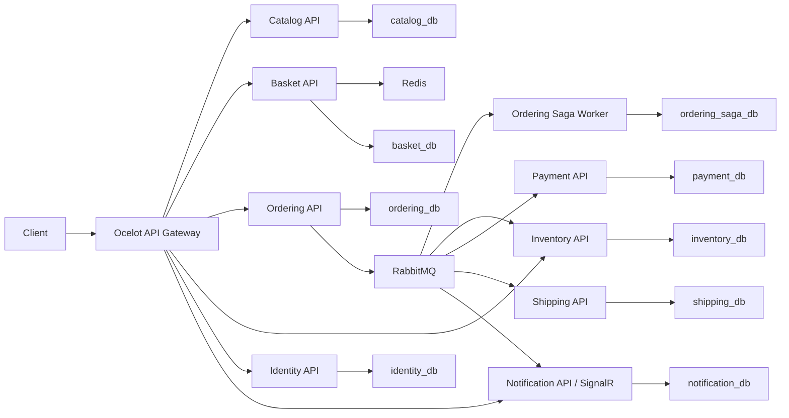

## Order Workflow

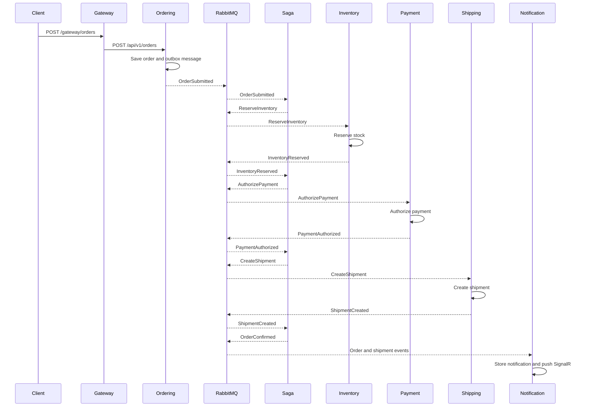

## Payment Failure Compensation

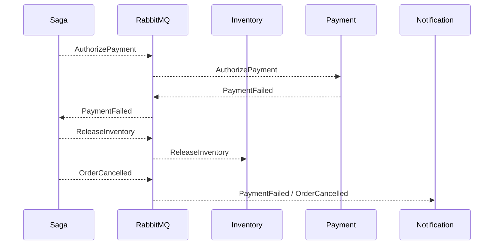

## Shipment Failure Compensation

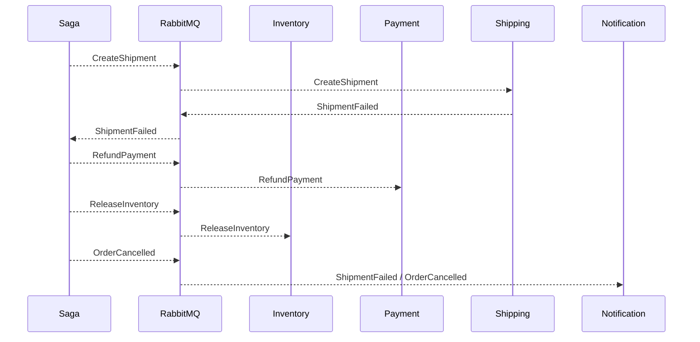

## Database Ownership

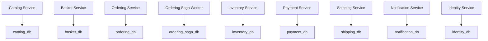

## Catalog Tables

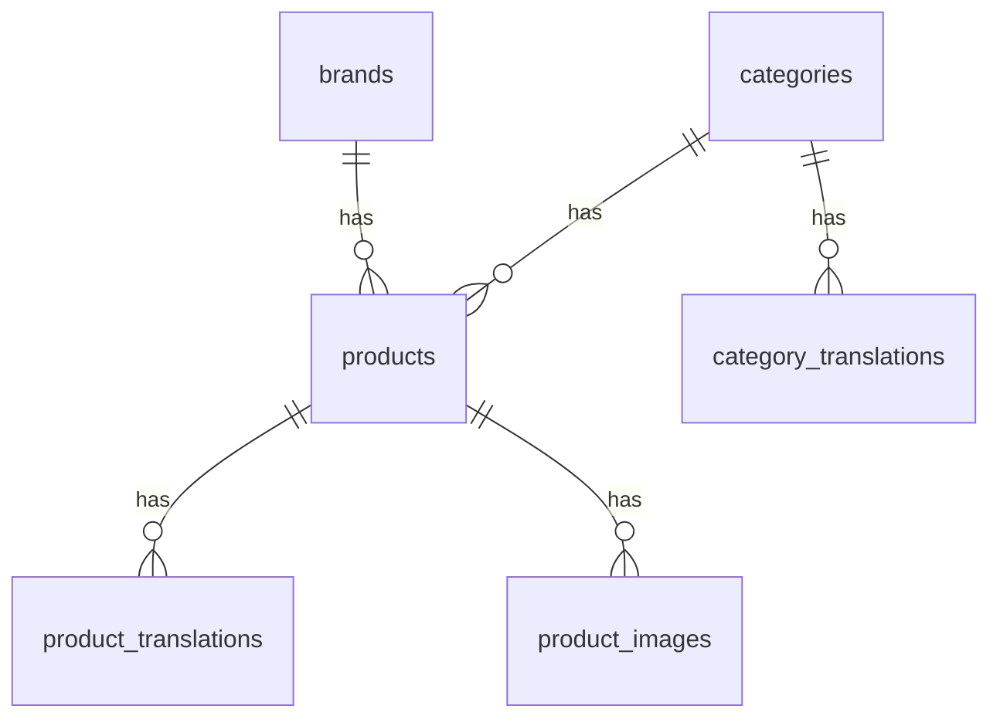

## Basket Tables

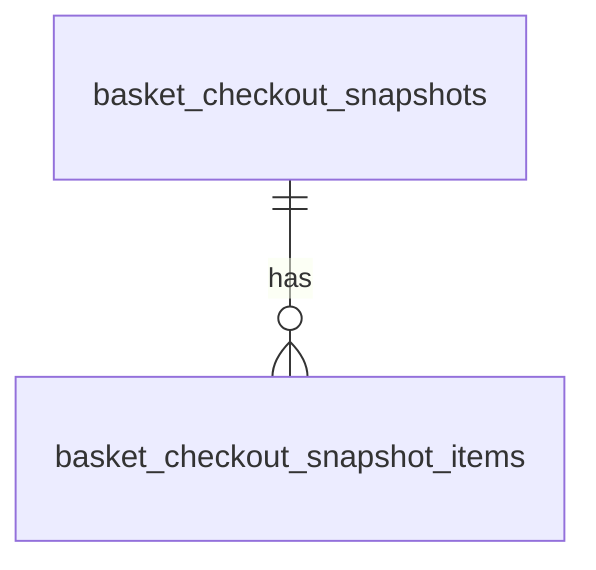

## Ordering Tables

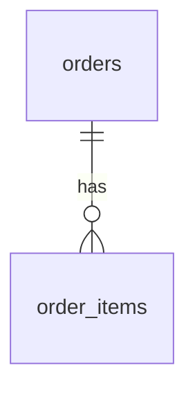

## Saga Tables

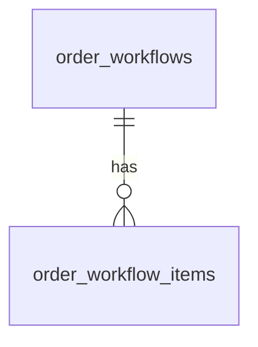

## Inventory Tables

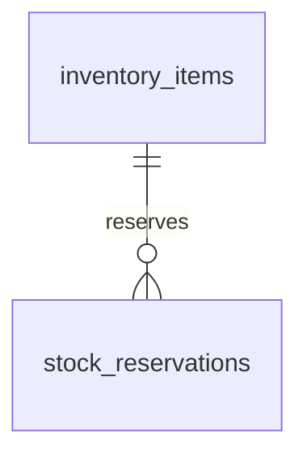

## Payment Tables

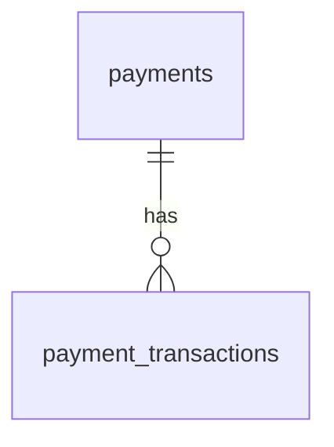

## Identity Tables

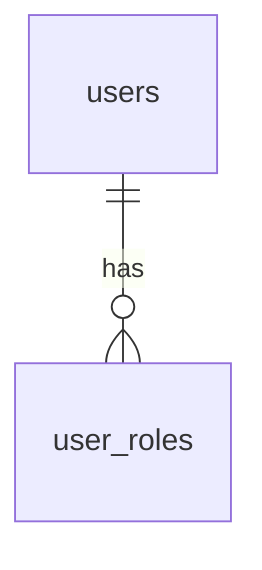

## Inbox and Outbox Per Service

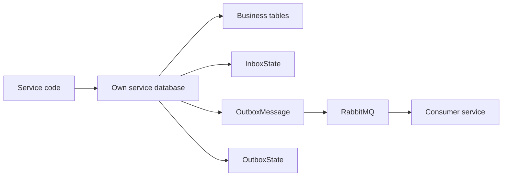
