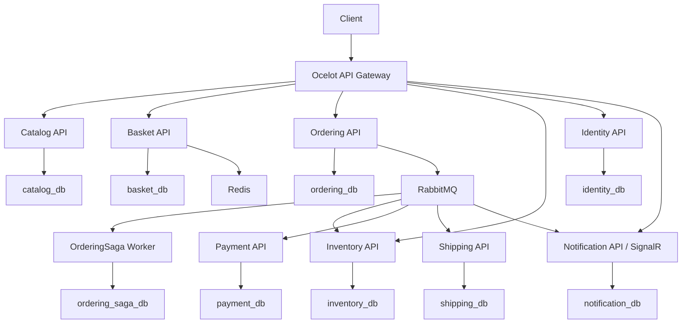
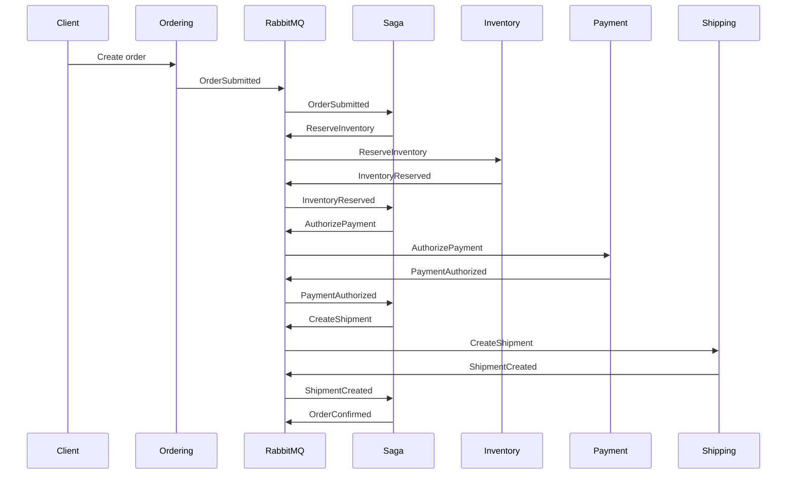
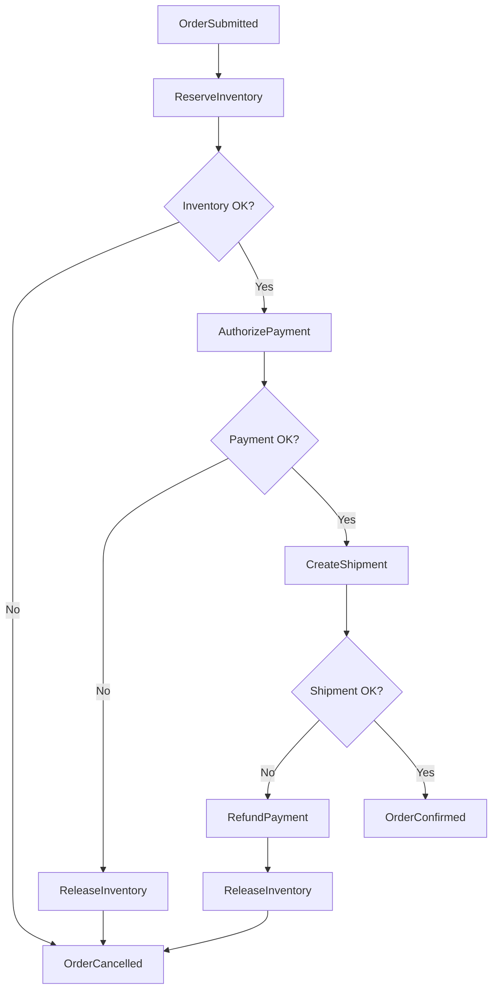
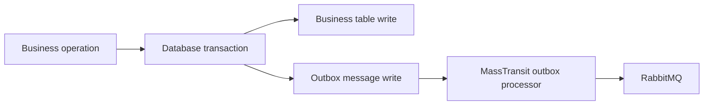
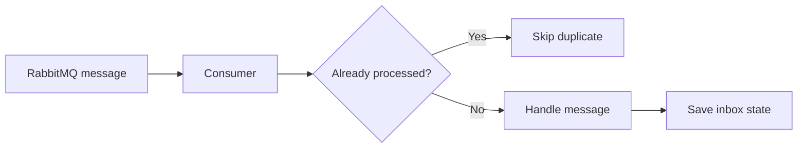

# Diyagramlar

Bu sayfa sistemi gorsel olarak anlamak icin basit diyagramlar icerir.

## Genel Mimari

```mermaid
flowchart TD
    Client["Client"] --> Gateway["Ocelot API Gateway"]
    Gateway --> Catalog["Catalog API"]
    Gateway --> Basket["Basket API"]
    Gateway --> Ordering["Ordering API"]
    Gateway --> Inventory["Inventory API"]
    Gateway --> Identity["Identity API"]
    Gateway --> Notification["Notification API / SignalR"]

    Catalog --> CatalogDb["catalog_db"]
    Basket --> BasketDb["basket_db"]
    Basket --> Redis["Redis"]
    Ordering --> OrderingDb["ordering_db"]
    Inventory --> InventoryDb["inventory_db"]
    Identity --> IdentityDb["identity_db"]
    Notification --> NotificationDb["notification_db"]

    Ordering --> RabbitMQ["RabbitMQ"]
    RabbitMQ --> Saga["OrderingSaga Worker"]
    RabbitMQ --> Inventory
    RabbitMQ --> Payment["Payment API"]
    RabbitMQ --> Shipping["Shipping API"]
    RabbitMQ --> Notification

    Saga --> SagaDb["ordering_saga_db"]
    Payment --> PaymentDb["payment_db"]
    Shipping --> ShippingDb["shipping_db"]
```

## Siparis Happy Path

```mermaid
sequenceDiagram
    participant Client
    participant Ordering
    participant RabbitMQ
    participant Saga
    participant Inventory
    participant Payment
    participant Shipping

    Client->>Ordering: Create order
    Ordering->>RabbitMQ: OrderSubmitted
    RabbitMQ->>Saga: OrderSubmitted
    Saga->>RabbitMQ: ReserveInventory
    RabbitMQ->>Inventory: ReserveInventory
    Inventory->>RabbitMQ: InventoryReserved
    RabbitMQ->>Saga: InventoryReserved
    Saga->>RabbitMQ: AuthorizePayment
    RabbitMQ->>Payment: AuthorizePayment
    Payment->>RabbitMQ: PaymentAuthorized
    RabbitMQ->>Saga: PaymentAuthorized
    Saga->>RabbitMQ: CreateShipment
    RabbitMQ->>Shipping: CreateShipment
    Shipping->>RabbitMQ: ShipmentCreated
    RabbitMQ->>Saga: ShipmentCreated
    Saga->>RabbitMQ: OrderConfirmed
```

## Compensation Akisi

```mermaid
flowchart TD
    A["OrderSubmitted"] --> B["ReserveInventory"]
    B --> C{"Inventory OK?"}
    C -- "No" --> X["OrderCancelled"]
    C -- "Yes" --> D["AuthorizePayment"]
    D --> E{"Payment OK?"}
    E -- "No" --> F["ReleaseInventory"]
    F --> X
    E -- "Yes" --> G["CreateShipment"]
    G --> H{"Shipment OK?"}
    H -- "No" --> I["RefundPayment"]
    I --> J["ReleaseInventory"]
    J --> X
    H -- "Yes" --> K["OrderConfirmed"]
```

## Outbox Mantigi

```mermaid
flowchart LR
    A["Business operation"] --> B["Database transaction"]
    B --> C["Business table write"]
    B --> D["Outbox message write"]
    D --> E["MassTransit outbox processor"]
    E --> F["RabbitMQ"]
```

## Inbox Mantigi

```mermaid
flowchart LR
    A["RabbitMQ message"] --> B["Consumer"]
    B --> C{"Already processed?"}
    C -- "Yes" --> D["Skip duplicate"]
    C -- "No" --> E["Handle message"]
    E --> F["Save inbox state"]
```
